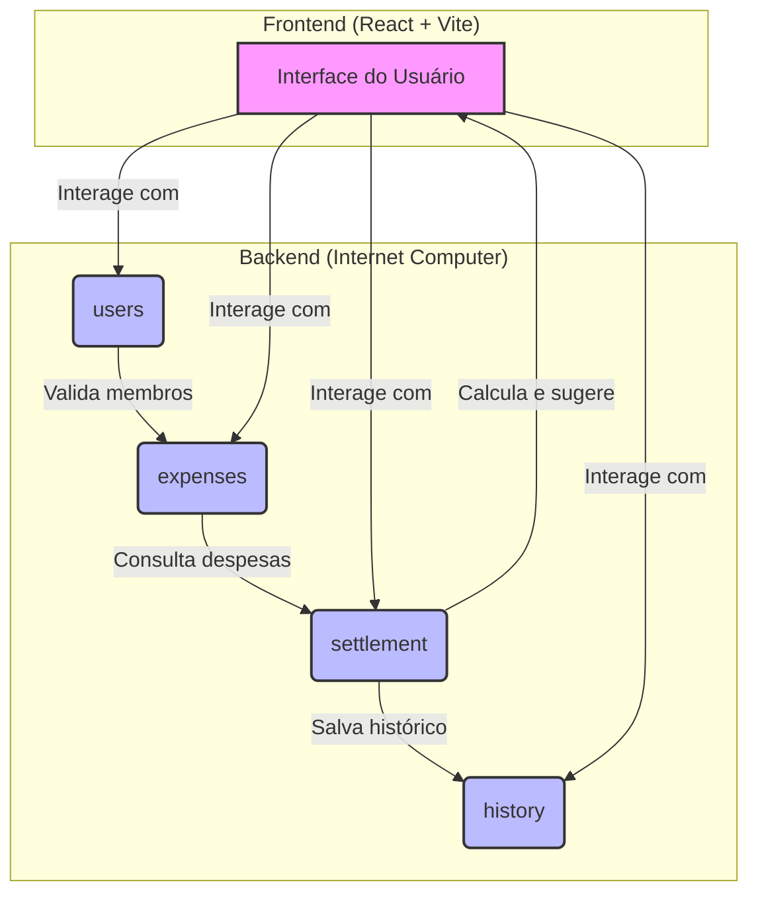

# Churrasplit

**Divida as contas de eventos em grupo de forma fácil e transparente.**

Churrasplit é um aplicativo descentralizado (dApp) construído na Internet Computer para gerenciar e dividir despesas em eventos sociais como churrascos, jantares ou viagens. Chega de planilhas confusas ou de perseguir amigos por dinheiro!


---

## O Problema

Organizar eventos com amigos é ótimo, mas dividir os custos pode ser um pesadelo. Quem pagou o quê? Quem ainda deve? Quanto cada um precisa acertar? Essas questões podem gerar atritos e complicar a diversão.

## A Solução

Churrasplit oferece uma calculadora colaborativa e transparente:
- **Crie Grupos:** Organize eventos e adicione os participantes.
- **Registre Despesas:** Cada membro pode adicionar o que pagou.
- **Cálculo Automático:** O app calcula o balanço de cada um em tempo real.
- **Sugestão de Acerto:** Um algoritmo inteligente sugere as transferências mínimas para zerar as dívidas.

---

## Funcionalidades 


- **Visualização de Grupos:** Tela inicial com a lista de grupos de despesas.
- **Detalhes do Grupo:** Veja todas as despesas de um grupo específico.
- **Balanço Financeiro:** Tabela clara mostrando quem deve e quem tem a receber.
- **Sugestões de Pagamento:** Roteiro de transferências para quitar todas as pendências.
- **Design Intuitivo:** Interface limpa e baseada na identidade visual da marca.

---

## Arquitetura

O projeto é desacoplado em um back-end na blockchain da Internet Computer e um front-end mockado para demonstração.



- **`users` Canister:** Gerencia usuários e grupos.
- **`expenses` Canister:** Armazena todas as despesas registradas.
- **`settlement` Canister:** Contém a lógica de negócio para calcular balanços e sugerir acertos.
- **`history` Canister:** Arquiva snapshots dos acertos de contas para referência futura.

---

## 🛠️ Stack Tecnológica

- **Backend:** Motoko, Internet Computer (DFX)
- **Frontend:** React, Vite, TypeScript
- **Estilização:** CSS puro com variáveis
- **Utilitários:** Prettier, ESLint

---

## 🏁 Guia de Início Rápido

**Pré-requisitos:**
- [Node.js](https://nodejs.org/) (v16+)
- [DFX](https://internetcomputer.org/docs/current/developer-docs/cli-reference/dfx-commands) (geralmente a versão mais recente)

**Passos para rodar o projeto:**

1.  **Clone o repositório:**
    ```sh
    git clone <URL_DO_REPOSITORIO>
    cd churrasplit
    ```

2.  **Inicie a réplica local da Internet Computer:**
    ```sh
    dfx start --background --clean
    ```

3.  **Instale as dependências dos canisters (se houver):**
    ```sh
    # Opcional, se usar Mops para gerenciar pacotes Motoko
    # mops install
    ```

4.  **Faça o deploy dos canisters na rede local:**
    ```sh
    dfx deploy
    ```

5.  **Navegue para a pasta do front-end e instale as dependências:**
    ```sh
    cd frontend
    npm install
    ```

6.  **Inicie o servidor de desenvolvimento do front-end:**
    ```sh
    npm run dev
    ```

7.  Abra seu navegador e acesse [http://localhost:5173](http://localhost:5173).

---

## 📜 APIs (Candid)

Abaixo estão as interfaces públicas de cada canister.

<details>
<summary><strong>Users Canister</strong></summary>

```candid
service : {
  register_user: (text) -> (User);
  get_me: () -> (opt User);
  create_group: (text, vec principal) -> (Group);
  list_groups: () -> (vec Group);
  list_users: () -> (vec User);
}
```
</details>

<details>
<summary><strong>Expenses Canister</strong></summary>

```candid
service : {
  add_expense: (nat, nat64, text, principal, vec principal) -> (Expense);
  list_expenses: (nat) -> (vec Expense);
  remove_expense: (nat) -> (bool);
}
```
</details>

<details>
<summary><strong>Settlement Canister</strong></summary>

```candid
service : {
  compute_balances: (nat) -> (vec Balance);
  suggest_settlements: (nat) -> (vec Transfer);
  simulate_with_extra: (nat, Expense) -> (vec Balance);
  snapshot_and_persist: (nat) -> (Snapshot);
}
```
</details>

<details>
<summary><strong>History Canister</strong></summary>

```candid
service : {
  save_snapshot: (Snapshot) -> (Snapshot);
  list_snapshots: (nat) -> (vec Snapshot);
  get_snapshot: (nat) -> (opt Snapshot);
}
```
</details>

---

## Modelo de Negócio (Potencial)

- **Freemium:** Grupos com até 5 membros e 20 despesas são gratuitos.
- **Premium (Assinatura):**
  - Grupos maiores e sem limite de despesas.
  - Histórico ilimitado de acertos.
  - Exportação de relatórios em PDF.
- **Taxa por Evento:** Uma pequena taxa (ex: 1%) sobre o valor total do acerto para eventos grandes.

---

## 🎬 Roteiro do Screencast (1 Minuto)

- **(0-10s) Tela Inicial:**
  - **Ação:** Mostrar a tela principal com os cards "Churrasco do Sábado" e "Pizza da Galera".
  - **Narração:** "Organizar um evento com amigos é ótimo, mas dividir a conta é sempre um problema. Com o Churrasplit, isso acaba."

- **(10-25s) Detalhes do Grupo:**
  - **Ação:** Clicar no grupo "Churrasco do Sábado". Mostrar a lista de despesas: carne, carvão, bebidas.
  - **Narração:** "Aqui, cada um lança o que gastou. Tudo fica registrado de forma transparente para o grupo."

- **(25-40s) Balanço Financeiro:**
  - **Ação:** Clicar em "Ver Saldos". Mostrar a tabela com quem deve (vermelho) e quem recebe (verde).
  - **Narração:** "Com um clique, o app calcula o balanço de todos. Fica fácil ver quem precisa pagar e quem vai receber."

- **(40-50s) Sugestão de Acerto:**
  - **Ação:** Clicar em "Sugerir Acertos". Mostrar a lista de transferências que resolvem tudo.
  - **Narração:** "O Churrasplit ainda otimiza os pagamentos, sugerindo o menor número de transferências para zerar a conta."

- **(50-60s) Visão Geral do Código e Encerramento:**
  - **Ação:** Mostrar rapidamente o VS Code com a estrutura de 4 canisters e a função `suggest_settlements`.
  - **Narração:** "Tudo isso rodando de forma descentralizada na Internet Computer, garantindo segurança e transparência. Churrasplit: a conta do churrasco, resolvida."

